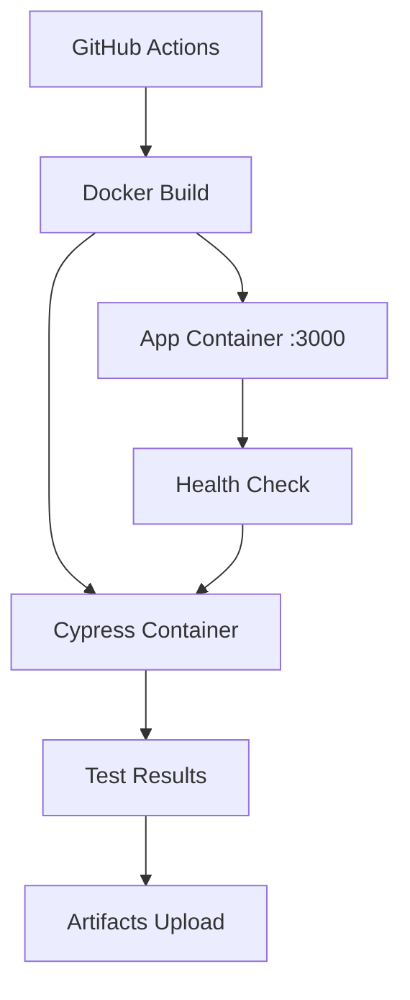

# Docker Setup cho Travel App

Hướng dẫn này sẽ giúp bạn chạy ứng dụng Travel App và Cypress test bằng Docker.

## 📋 Yêu cầu

- Docker 20.10+
- Docker Compose 2.0+

## 🚀 Cách sử dụng

### 1. Production Mode (Build App + Run Test)

```bash
# Build và chạy app cùng cypress test
npm run docker:test

# Hoặc chạy thủ công:
docker-compose up --build
```

### 2. Development Mode 

```bash
# Chạy app ở development mode
npm run docker:dev

# Chạy app ở background
npm run docker:dev-d

# Chạy cypress test với dev app
npm run docker:test-dev
```

### 3. Chỉ chạy App

```bash
# Production app (port 3000)
docker-compose up app

# Development app (port 5173)  
docker-compose -f docker-compose.dev.yml up app-dev
```

### 4. Dọn dẹp

```bash
# Dừng và xóa containers
npm run docker:down

# Xóa images (nếu cần)
docker-compose down --rmi all

# Xóa volumes
docker-compose down --volumes
```

## 🔧 Cấu hình

### Ports
- **Production App**: http://localhost:3000
- **Development App**: http://localhost:5173
- **Cypress**: Chạy trong container, kết quả lưu trong `test/results/`

### Environment Variables
- `CYPRESS_baseUrl`: URL của app (tự động set trong Docker)
- `NODE_ENV`: production/development

## 📁 File Structure

```
travel-app/
├── Dockerfile              # Production app
├── Dockerfile.dev          # Development app  
├── Dockerfile.cypress      # Cypress test
├── docker-compose.yml      # Production orchestration
├── docker-compose.dev.yml  # Development orchestration
└── .dockerignore           # Docker ignore rules
```

## 🧪 GitHub Actions

Khi push code lên GitHub, tự động chạy:
1. Build app trong Docker
2. Chạy Cypress test
3. Upload test artifacts

## 🐛 Troubleshooting

### Lỗi kết nối app và Cypress
```bash
# Kiểm tra containers
docker-compose ps

# Xem logs
docker-compose logs app
docker-compose logs cypress
```

### Port đã được sử dụng
```bash
# Kiểm tra port đang dùng
lsof -i :3000
lsof -i :5173

# Hoặc thay đổi port trong docker-compose.yml
```

### Rebuild images
```bash
# Force rebuild
docker-compose build --no-cache
docker-compose up --build --force-recreate
```

## 📝 Scripts Chính

| Script | Mô tả |
|--------|--------|
| `npm run docker:test` | Build + chạy app + cypress test |
| `npm run docker:dev` | Chạy development mode |
| `npm run docker:up` | Chỉ start services |
| `npm run docker:down` | Stop tất cả services |

## 🏗️ Kiến trúc



Cypress container sẽ đợi App container sẵn sàng (health check) trước khi chạy test. 